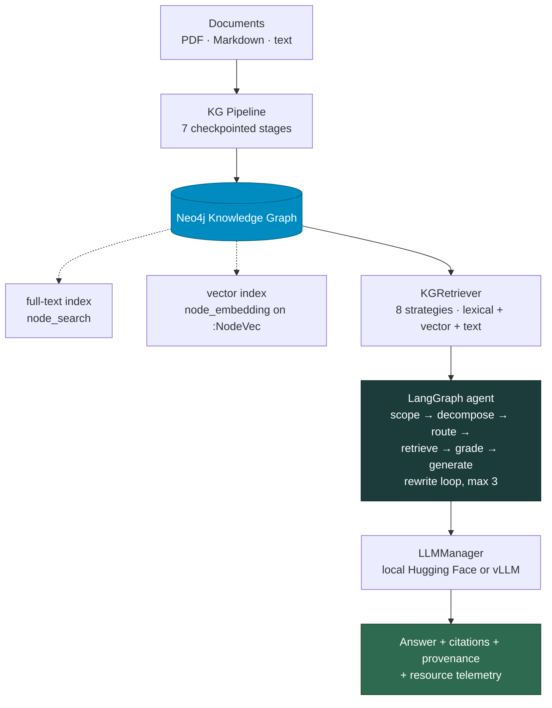

<div align="center">

<h1>GraphRAG Pipeline</h1>

<p><strong>An experiment-oriented Retrieval-Augmented Generation pipeline that builds a Knowledge Graph from a document corpus, retrieves over it through eight configurable strategies, and scores the answers against a frozen reference set.</strong></p>

[](https://github.com/FrancescoLazzarotto/graphRAG-pipeline/actions/workflows/ci.yml)
[](#testing)
[](https://www.python.org/)
[](https://neo4j.com/)
[](https://langchain-ai.github.io/langgraph/)
[](LICENSE)

<sub>Applied to a bilingual Italian/English corpus on the circular economy of food · retrieval, generation and evaluation in one repository</sub>

</div>

---

> [!NOTE]
> This is a research codebase. Every number it produces is traceable to a
> configuration file written next to it, and the sections that would let a
> reader over-read a result — [Known Limitations](#known-limitations) and
> [Reproducibility Notes](#reproducibility-notes) — are part of the
> documentation, not an appendix.

## Table of Contents

| | | |
|---|---|---|
| [Overview](#overview) | [Knowledge Graph Pipeline](#knowledge-graph-pipeline) | [Testing](#testing) |
| [Quick Start](#quick-start) | [Retrieval](#retrieval) | [Cluster & Batch Jobs](#cluster--batch-jobs) |
| [Architecture](#architecture) | [Experiments](#experiments) | [Repository Structure](#repository-structure) |
| [Installation](#installation) | [Analysis & Telemetry](#analysis--telemetry) | [Troubleshooting](#troubleshooting) |
| [Configuration](#configuration) | [Evaluation](#evaluation) | [Known Limitations](#known-limitations) |
| [Usage](#usage) | [Interactive Demos](#interactive-demos) | [Reproducibility Notes](#reproducibility-notes) |

---

## Overview

The repository covers the full path from a folder of PDFs to a scored table:

| Stage | What happens |
|---|---|
| **Ingest** | PDF, Markdown and plain text are loaded, chunked by page-count profile, and passed through NER (GLiNER, multilingual) and LLM triple extraction |
| **Build** | Entities are resolved and linked — embeddings, predicate Jaccard, LLM confirmation — then ingested into Neo4j |
| **Retrieve** | Eight strategies, from pure text to 2-hop subgraph expansion and shortest-path traversal, over a **lexical** full-text channel and an optional **multilingual vector** channel |
| **Generate** | A LangGraph agent — scope → retrieve → grade → generate, with a bounded rewrite loop — backed by local Hugging Face models or an OpenAI-compatible vLLM server |
| **Ground** | Numbered evidence with document and page, a citation gate that checks every `[S1]`/`[T3]` tag against the visible index, a quote gate that checks every «quoted» passage against the retrieved text, and an optional verbatim-definition opener |
| **Measure** | Reproducible experiment matrices with resource telemetry, and an evaluation toolkit: retrieval metrics, text similarity, LLM-as-a-Judge, optional RAGAS, and a two-channel / two-level gold scorer |

### Entry points

| Entry point | Purpose |
|---|---|
| `graphrag-demo` — or `python -m graphrag.cli` | Single-question retrieval/generation and batch experiments; the full option surface |
| `python -m kg_pipeline.main` | Knowledge Graph construction pipeline |
| `python scripts/run_retrieval_matrix.py` | Standard-RAG vs GraphRAG matrices with resource telemetry |
| `python -m evalkit.cli` — with `PYTHONPATH=evaluation` | Evaluation toolkit |
| `python evaluation/scripts/score_gold_run.py` | Gold scoring for the paper: two channels, two levels |
| `streamlit run product/app.py` | Expert demo console |

A complete command reference lives in **[COMMANDS.md](COMMANDS.md)**.

---

## Quick Start

Assumes a populated Neo4j instance and a vLLM server already running.

```bash
# 1. environment
conda create -n graphllm python=3.10 -y && conda activate graphllm
pip install -r requirements.txt && pip install -e .

# 2. credentials
cp .env.example .env && $EDITOR .env

# 3. health check — Neo4j and LLM connectivity
python scripts/smoke_check.py

# 4. one grounded, cited answer
graphrag-demo --llm --vllm --strategies hybrid \
  --question "What are the three C's of the Circular Economy for Food framework?" \
  --cite-evidence --citation-display label --enforce-language

# 5. the full reference campaign, 30 questions x 8 strategies
bash scripts/run_abstention_arms.sh
```

Starting from an empty graph instead? Go to
[Knowledge Graph Pipeline](#knowledge-graph-pipeline) first — retrieval quality
depends on the two index-building scripts run at its end.

---

## Architecture



The two dotted boxes are not optional decoration: the lexical index carries
in-language lookup and the vector index is the only channel that crosses the
Italian/English gap. Both are built by scripts, not by ingestion.

---

## Installation

Recommended environment: Conda, named `graphllm`, Python 3.10+.

```bash
conda create -n graphllm python=3.10 -y
conda activate graphllm
```

Pick **one** requirements file for your target — the three form a hierarchy, not
a sequence:

| File | Target | Notes |
|---|---|---|
| `requirements.txt` | Local development | Loose bounds |
| `requirements-cpu.txt` | CPU cluster nodes | Bounded versions, reproducible |
| `requirements-gpu.txt` | GPU nodes, CUDA 12.4 | Pins `torch==2.5.1+cu124`, `torchvision==0.20.1+cu124`, vLLM |

```bash
pip install -r requirements.txt
pip install -e .
```

Every runtime import is now declared — `pymupdf4llm`, `gliner`, `openai`,
`pyyaml`, `requests`, `faiss-cpu`, `sentence-transformers` and `sacrebleu` are in
all three files and in `pyproject.toml`. No manual follow-up install is needed.

Evaluation extras — RAGAS, ROUGE, plotting — are separate and optional:

```bash
pip install -r evaluation/requirements.txt
```

> [!TIP]
> Without `sacrebleu`, evalkit falls back to a simplified local BLEU. Keep it
> installed so published metrics come from the reference implementation.

---

## Configuration

```bash
cp .env.example .env
```

### Neo4j

| Variable | Required | Description |
|---|---|---|
| `NEO4J_URL` | ✅ | Connection URI, e.g. `bolt://localhost:7687` or `neo4j+s://<instance>` |
| `NEO4J_USERNAME` | ✅ | Database user |
| `NEO4J_PASSWORD` | ✅ | Database password |
| `NEO4J_DATABASE` | — | Target database name |
| `NEO4J_URI` | — | Same value as `NEO4J_URL`; read by the `scripts/kg_repair3/4/5.py` post-processing passes |

> [!IMPORTANT]
> The instance must have **APOC** available. Every node and triple projection
> goes through `apoc.map.removeKey` to strip the embedding vector from the
> returned properties, and there is no fallback projection.

### Generation endpoint

| Variable | Default | Description |
|---|---|---|
| `VLLM_BASE_URL` | `http://localhost:8000/v1` | vLLM / OpenAI-compatible endpoint |
| `VLLM_MODEL_NAME` | — | Model name served there |
| `VLLM_API_KEY` / `OPENAI_API_KEY` | — | API key, if required |
| `HF_TOKEN` | — | Hugging Face token for gated models |

### Embedding endpoint — the cross-lingual vector channel

| Variable | Default | Description |
|---|---|---|
| `GRAPHRAG_EMBED_BASE_URL` | `http://localhost:8002/v1` | OpenAI-compatible `/embeddings` endpoint |
| `GRAPHRAG_EMBED_MODEL` | `intfloat/multilingual-e5-base` | Encoder id; **must match the one the index was built with** |

```bash
bash scripts/start_vllm_encoder.sh        # GPU 1, port 8002, pooling runner
```

The script exists because the command used to live only inside an abort message,
and a mistyped restart cost a campaign its vector channel on three of six models.
Changing `GRAPHRAG_EMBED_MODEL` means rebuilding the index with
`scripts/kg_vector_index.py`.

<details>
<summary><b>Optional runtime knobs</b></summary>

| Variable | Default | Effect |
|---|---|---|
| `GRAPHRAG_FULLTEXT_INDEX` | `node_search` | Full-text index name |
| `GRAPHRAG_VECTOR_PROPERTY` | `embedding` | Property stripped from node projections |
| `GRAPHRAG_VECTOR_ALLOW_DEGRADED` | unset | `1` lets a failed encoder degrade to lexical-only instead of raising. **Interactive use only** — see [Reproducibility Notes](#reproducibility-notes) |
| `GRAPHRAG_EMBED_RETRIES` | `3` | Encoder retries before the channel gives up |
| `GRAPHRAG_EMBED_RETRY_BACKOFF_SEC` | `1.0` | Backoff between encoder retries |
| `GRAPHRAG_EMBED_MAX_CHARS` | — | Truncation applied before the encoder's context window |
| `GRAPHRAG_NEO4J_QUERY_RETRIES` | `3` | Transient-error retries per Cypher query |
| `GRAPHRAG_NEO4J_QUERY_RETRY_BACKOFF_SEC` | `1.0` | Backoff between Cypher retries |
| `GRAPHRAG_LLM_GENERATE_RETRIES` | `2` | Transient-error retries per LLM call |
| `GRAPHRAG_LLM_GENERATE_RETRY_BACKOFF_SEC` | `1.0` | Backoff between LLM retries |
| `GRAPHRAG_VLLM_HEALTHCHECK_TIMEOUT_SEC` | `5` | Endpoint health-check timeout |
| `GRAPHRAG_LLM_CONCURRENT_REQUESTS` | `8` | Stage-3 extraction concurrency |
| `GRAPHRAG_OFFLOAD_DIR` / `GRAPHRAG_CPU_OFFLOAD_GIB` | — | Local-model offload target and budget |
| `GRAPHRAG_TORCH_COMPILE` | unset | Opt into `torch.compile` for local models |
| `KG_EXTRACTION_MAX_TOKENS` | `4096` | Output cap per extraction call |
| `KG_NER_DEVICE` / `KG_EMBED_DEVICE` | — | Device placement for GLiNER and the resolution encoder |
| `KG_PIPELINE_DEBUG_OPENAI` | unset | Log raw extraction requests and responses |
| `VLLM_HTTP_TIMEOUT` | `900` | OpenAI-client timeout in the KG pipeline |
| `PYTHONHASHSEED` | — | Export before launching if set-iteration order must be reproducible; the pipeline warns when it is unset |

</details>

> [!WARNING]
> `scripts/smoke_check.py` reads **exported** environment variables only — it
> does not auto-load `.env`.

---

## Usage

### Retrieval only

```bash
graphrag-demo \
  --question "What are the relations between Entity A and Entity B?" \
  --entity "Entity A"
```

### Generation

```bash
# local Hugging Face weights
graphrag-demo --llm --model-id Qwen/Qwen2.5-7B-Instruct

# vLLM / OpenAI-compatible server
graphrag-demo --llm --vllm \
  --vllm-base-url http://localhost:8000/v1 \
  --model-id Qwen/Qwen2.5-7B-Instruct
```

### Grounded, cited answers

```bash
graphrag-demo --llm --vllm \
  --strategies hybrid \
  --cite-evidence --citation-policy mark --citation-display label \
  --prefer-verbatim-definitions \
  --enforce-language --focused-answer --complexity high
```

| Flag | Effect |
|---|---|
| `--cite-evidence` | Numbers the evidence, asks for `[S1]`/`[T1]` tags, verifies every tag against the **visible** index — the refs that survived context compression |
| `--citation-policy` | `mark` flags an invented tag in place, `strip` deletes it |
| `--citation-display` | `id` keeps `[S1]`; `label` rewrites it as `[Document, p. 12]` after the gate |
| `--prefer-verbatim-definitions` | Ranks the defining passage first and opens the answer with it, quoted and checked |
| `--enforce-language` | Pins the answer to the question's language, with one retry on a mismatch |
| `--focused-answer` | Answer only what was asked, not every related concept in the evidence |
| `--complexity` | `low` / `medium` / `high`; `high` drops the two-paragraph cap and adds the specificity rule |
| `--allow-parametric-fallback` | Permits parametric knowledge where evidence does not cover the question, marked `(not in the retrieved evidence)` so grounded and ungrounded stay separable |
| `--evidence-max-triple-items` | Cap on numbered triple evidence blocks in the context (default **30**) |

### Cross-lingual retrieval

The graph is largely Italian; English questions cannot reach Italian node names
lexically. The vector channel is **added** to the lexical one, never replacing it.

```bash
python scripts/kg_vector_index.py    # once, after the KG is built

graphrag-demo --llm --vllm \
  --vector-retrieval --vector-nodes-limit 10 --vector-triples-limit 10 \
  --seed-from-retrieved --subgraph-seed-count 3 \
  --drop-predicates "RELATED_TO,PUBLISHED,AUTHORED_BY"
```

### Abstention on out-of-domain questions

```bash
graphrag-demo --llm --vllm --enable-domain-gate
```

One classification call before retrieval. Without it the agent has no terminal
refusal state: the dense retriever has no score floor, so `grade` always sees
evidence and every question reaches `generate`.

<details>
<summary><b>Full flag reference — retrieval shape, text channel, generation</b></summary>

**Graph channels**

| Flag | Effect |
|---|---|
| `--strategies` | Comma-separated presets; see [Retrieval strategies](#retrieval-strategies) |
| `--seed-from-retrieved` | Anchor the neighbour / subgraph / shortest-path channels on names retrieval actually returned, not on raw question words |
| `--subgraph-seed-count` | How many anchors the subgraph channel expands from (default 1 = best only) |
| `--subgraph-limit` | Triples the subgraph channel may pull per anchor set **before** ranking. Applied in Cypher, so it truncates in graph order and the ranker never sees what was cut |
| `--drop-predicates` | Comma-separated predicates removed from retrieved triples |
| `--vector-retrieval` / `--vector-index` / `--vector-nodes-limit` / `--vector-triples-limit` | The multilingual vector channel and its budgets |

**Text channel**

| Flag | Effect |
|---|---|
| `--text-retriever-backend` | `tfidf` (lexical, default — ranked with Okapi BM25) or `dense` (cosine/FAISS) |
| `--text-docs-dir` | Documents to index for the text channel; auto-discovered from the latest stage-0 artifacts when omitted |
| `--text-stage0-runs` | Which `kg_pipeline/artifacts` runs feed the text index, most authoritative first |
| `--text-retriever-mmr` / `--text-retriever-mmr-lambda` | Maximal Marginal Relevance instead of pure top-k; `1.0` is pure similarity |
| `--text-retriever-max-per-doc` | Cap on chunks from one document (`0` disables); enumerative questions get twice the budget |
| `--dense-embedding-model` / `--vector-index-dir` | Dense backend model and persisted FAISS cache |

**Agent and generation**

| Flag | Effect |
|---|---|
| `--enable-decomposition-step` / `--enable-adaptive-routing-step` | Optional LLM steps before retrieval |
| `--enable-domain-gate` | Scope classification and refusal |
| `--legacy-insufficiency-wording` | Restores the pre-repair closing line of the answer prompt; for reproducing campaigns E1–E8 |
| `--max-new-tokens` | Caps generation length and cost |
| `--max-context-tokens` | Caps the compressed prompt context (default **6000**) |
| `--recursion-limit` | Maximum LangGraph steps before aborting |
| `--llm-warmup` | Preload the model at startup |
| `--gpu-memory-fraction` | Reserves headroom when loading large local models |
| `--allow-large-model-fp16-fallback` | For models ≥ 30B, fp16 fallback is off by default; enable only with the memory/precision trade-off understood |

</details>

### Test-suite generation

```bash
conda run -n graphllm python scripts/generate_questions.py generate
conda run -n graphllm python scripts/generate_questions.py generate --question-language en
conda run -n graphllm python scripts/generate_questions.py stats --input artifacts/tmp/graphrag_test_suite.json
```

Defaults to the most recent `kg_pipeline/artifacts/run_*` directory and writes to
`artifacts/tmp/graphrag_test_suite.json` unless `--output` is given. Use
`--matrix-output` for one-question-per-line text.

---

## Knowledge Graph Pipeline

The pipeline lives in [`kg_pipeline/`](kg_pipeline/) and writes checkpointed
stage artifacts to a run directory. Defaults come from
[`kg_pipeline/config.yaml`](kg_pipeline/config.yaml).

```bash
conda activate graphllm
PYTHONUNBUFFERED=1 python -m kg_pipeline.main \
  --config kg_pipeline/config.yaml \
  --env-file kg_pipeline/.env \
  --log-level INFO
```

### Stages

Stages run sequentially with JSON checkpoint recovery — each reads the artifacts
of the previous one. `--stage <name>` runs everything **up to and including**
that stage, reusing earlier artifacts where they exist; it does not run one stage
in isolation. Reuse the same `--run-dir` to resume.

| `--stage` | Description | Main artifact |
|---|---|---|
| `ingestion` | Load raw documents — PDF → markdown, page chunks, sections | `stage0_documents.json` |
| `chunking` | Token-windowed paragraph chunks, three size profiles by page count | `stage1_chunks.json` |
| `ner` | Named Entity Recognition — GLiNER, multilingual | `stage2_ner.json` |
| `llm` | LLM triple extraction — async, batched, checkpointed | `stage3_triples_raw.json`, `stage3_acronyms.json` |
| `resolution` | Entity resolution — embeddings + predicate Jaccard + LLM confirmation | `stage4_triples_resolved.json`, `stage4_registry.json`, `stage4_merge_approved.json` |
| `linking` | `SAME_AS` alias edges, optional `MENTIONED_IN` | `stage5_triples_linked.json` |
| `neo4j` | Graph ingestion — UNWIND + MERGE per label/predicate signature | `stage6_neo4j_summary.json` |

Useful flags: `--dry-run` skips Neo4j ingestion; `--single-doc <name>` processes
one document; `--run-dir <path>` resumes. Stage 3 checkpoints every
`llm.checkpoint_every` chunks with atomic writes, and re-running without clearing
the checkpoint resumes from the last saved chunk.

<details>
<summary><b>Run directory layout</b></summary>

```text
kg_pipeline/artifacts/run_<tag>/
├── pipeline.log
├── run_metadata.json           # seed, models, git commit, vLLM endpoint
├── config.yaml                 # snapshot of the config used
├── relation_vocab_*.json       # snapshot of the predicate vocabulary
├── failed_chunks.jsonl         # malformed LLM outputs; the pipeline continues
├── new_labels.log
├── stage0_documents.json
├── stage1_chunks.json
├── stage2_ner.json
├── stage3_triples_raw.json
├── stage3_acronyms.json
├── stage3_checkpoint.json
├── stage3_checkpoint_info.json
├── stage4_triples_resolved.json
├── stage4_registry.json
├── stage4_merge_approved.json
├── stage5_triples_linked.json
└── stage6_neo4j_summary.json   # triples_sent + counts read back from Neo4j
```

</details>

### Post-processing and indexes

After Neo4j ingestion, **in this order**:

```bash
python scripts/kg_postprocess.py --passes 1,2,3,4,5   # repair passes kg_repair.py .. kg_repair5.py
python scripts/kg_search_index.py                     # full-text index — lexical retrieval
python scripts/kg_vector_index.py                     # :NodeVec carriers + vector index — cross-lingual
```

The passes are distinct ordered repair rounds, not versions of one script.
Retrieval quality depends on the last two commands having been run against the
live graph.

Other graph utilities: `kg_backup.py` / `kg_restore.py`, `kg_densify.py`,
`kg_ontology_align.py`, `kg_translate_names.py`, `kg_apply_translations.py`,
`kg_collapse_aliases.py`, `kg_slot_ceiling.py`, `kg_evaluator.py`,
`compare_kg_variants.py`, `kg_wipe.py`, and the passes under `scripts/kg_quality/`.

---

## Retrieval

For each query the `KGRetriever`:

1. extracts entity candidates — quoted spans, capitalised phrases, numeric terms — and content keywords, optionally weighted by node-name document frequency (`lexical_specificity`);
2. runs one **lexical** full-text query, a Lucene OR-query with per-term boosts, for nodes and for triples;
3. optionally runs a **vector** query against the `:NodeVec` carriers — the only channel that crosses the IT/EN gap;
4. picks anchors, by default only names retrieval actually returned (`verify_anchor_exists`), which avoids a full graph scan on an anchor that matches nothing;
5. expands neighbours, the 2-hop subgraph from `subgraph_seed_count` anchors, and the shortest path;
6. drops uninformative predicates and ranks triples — lexical overlap · mention count · confidence, penalised for system links;
7. optionally retrieves raw text (BM25 or dense FAISS), capped per document and re-ranked for definitional questions.

**Failure behaviour differs by channel, on purpose:**

| Missing | Behaviour |
|---|---|
| Full-text index | Falls back to a per-term `CONTAINS` scan, with a warning |
| Vector index not built | Lexical only, with a warning |
| Embedding endpoint failing after its retries | **Raises.** A silent, model-asymmetric change of retrieval method mid-comparison is worse than a stopped run. Set `GRAPHRAG_VECTOR_ALLOW_DEGRADED=1` to restore degradation for interactive use |

### Retrieval strategies

| Strategy | Evidence used |
|---|---|
| `default` | All KG channels: nodes, triples, neighborhoods, 2-hop subgraph, shortest paths |
| `hybrid` | All KG channels **plus** raw-text retrieval |
| `text_only` | Text retrieval only — no KG |
| `no_retrieval` | No retrieval channel — the LLM-only baseline |
| `text_plus_triples` | Entity nodes and triples only — no graph traversal |
| `neighbors_focus` | Triples plus local entity neighborhoods |
| `subgraph_2hop` | Triples plus 2-hop subgraph expansion |
| `shortest_path` | Triples plus shortest paths between entities |

Defined once in [`src/graphrag/strategies.py`](src/graphrag/strategies.py) and
shared by the CLI and the matrix runner. Presets toggle only the channel flags;
cardinality limits and ranking options come from the base `AgentConfig`, and the
fully resolved per-strategy config is serialised into every run's `config.json`.

---

## Experiments

### Reference sets

Two frozen sets ship with the repository, 30 questions each, same annotation:

| File | Language | Notes |
|---|---|---|
| [`gold_v3.json`](evaluation/gold/gold_v3.json) | English | The reference set every thesis number is measured on |
| [`gold_v3_it.json`](evaluation/gold/gold_v3_it.json) | Italian | Same expected entities, relations, reference answer and scoring block; only `query` changes, and `query_en` carries the original. Built by `scripts/build_gold_it.py` |

Each entry carries `query_id`, `query_type`, `query`, `expected_answer`,
`expected_entities`, `expected_relations`, `source_verified` and `scoring`.
Passing the `.json` straight to `--questions-file` makes the run emit `query_id`,
so the evaluator joins by id rather than by question text.

### Which runner to use

| | `python -m graphrag.cli --experiment` | `scripts/run_retrieval_matrix.py` |
|---|:---:|:---:|
| GraphRAG strategies | ✅ | ✅ |
| Standard-RAG baselines — tfidf / dense presets | ❌ | ✅ |
| Resource telemetry — CPU/RAM/GPU | ❌ | ✅ |
| `query_id` carried into `results.jsonl` | ✅ | ❌ |
| Vector channel, citations, domain gate, complexity, … | ✅ | ❌ |

Use the CLI for anything the gold evaluation will score; use the matrix runner
for Standard-RAG comparisons and sizing studies.

### Batch run via the CLI

```bash
conda run -n graphllm python -m graphrag.cli --experiment \
  --questions-file evaluation/gold/gold_v3.json \
  --strategies "default,hybrid,text_only,no_retrieval,text_plus_triples,neighbors_focus,subgraph_2hop,shortest_path" \
  --llm --vllm --vllm-base-url http://localhost:8000/v1 \
  --model-id Qwen/Qwen2.5-32B-Instruct \
  --vector-retrieval --seed-from-retrieved \
  --cite-evidence --complexity medium --max-new-tokens 1024 \
  --output-dir exp_results --experiment-tag thesis_qwen25_32b
```

### Prepared campaign drivers

Each script runs a whole family of arms in **one server session**, so the
comparison is within-session and the cross-session noise band does not apply.
All three preflight the generator, the encoder, and — critically — that the
vector index still *resolves*.

| Script | What it measures |
|---|---|
| [`scripts/run_abstention_arms.sh`](scripts/run_abstention_arms.sh) | Three arms isolating the abstention path: `a0` pre-repair prompt wording, `a1` repaired wording, `a2` repaired wording plus domain gate |
| [`scripts/run_italian_arm.sh`](scripts/run_italian_arm.sh) | The same 30 questions asked in Italian. Its control is the `a1` arm above; 44% of expected concept slots exist in the graph only under an Italian name, against 22% reachable under an English one |
| [`scripts/run_gold_variant.sh`](scripts/run_gold_variant.sh) | One gold campaign per KG variant against the local staging graph — comparable to each other, not to the Aura runs |

```bash
bash scripts/run_abstention_arms.sh
bash scripts/run_italian_arm.sh
VARIANT=v2_baseline bash scripts/run_gold_variant.sh
```

> [!WARNING]
> A carrier count cannot tell a live vector index from one whose identifiers went
> stale under a store reload — the count passes, the channel silently degrades to
> lexical, and the campaign looks complete. Measured once, that cost 0.03–0.06
> concept F1 on every graph strategy. Guard with
> `python scripts/check_vector_index.py --min-resolving 1000`, which counts
> carriers that still resolve to a node.

### Retrieval matrices

```bash
# smoke matrix — always run this before a long job
python scripts/run_retrieval_matrix.py \
  --smoke \
  --questions-file artifacts/experiments/questions_smoke.txt \
  --documents docs/ README.md \
  --runs-per-strategy 1 \
  --output-dir artifacts/experiments \
  --experiment-tag retrieval_matrix_smoke

# full vLLM-backed matrix
python scripts/run_retrieval_matrix.py \
  --llm --vllm \
  --vllm-base-url http://localhost:8000/v1 \
  --model-id Qwen/Qwen2.5-32B-Instruct \
  --questions-file evaluation/fixtures/questions_matrix_long.txt \
  --graph-strategies default \
  --runs-per-strategy 1
```

`--questions-file` accepts plain text (one question per line) and JSON suites
from `scripts/generate_questions.py`. Verify that `summary.json` and
`results.jsonl` appear in the output directory before committing to a long run.

---

## Analysis & Telemetry

```text
<output-dir>/<timestamp>_<tag>/
├── results.jsonl           # one record per question/strategy/run
├── results.csv             # tabular version
├── summary.txt             # fast human-readable check
├── summary.json            # structured statistics per strategy
├── config.json             # CLI args + graph_target + resolved AgentConfig per strategy
├── resource_samples.jsonl  # raw telemetry samples (matrix runner)
└── resource_summary.json   # peak and average resource usage (matrix runner)
```

`config.json` makes every metric traceable to its exact configuration. Its
`graph_target` block records the Neo4j URL and database and the embedding
endpoint and model actually used — the password is deliberately not recorded — so
"was this run against staging or against Aura?" is answerable from the outputs
alone.

| Script | Purpose |
|---|---|
| `scripts/analyze_experiments.py` | Analyze a single run directory |
| `scripts/analyze_matrix.py` | Aggregate multiple runs into CSV/JSON summaries |
| `scripts/analyze_resource_usage.py` | Sizing and resource comparison across runs |
| `scripts/answer_diff.py` | Side-by-side answer comparison between runs |
| `scripts/provenance_precision.py` | Attribute retrieved text back to its origin documents |
| `scripts/kg_variant_significance.py` | Significance testing across KG variants |
| `evaluation/scripts/build_results_tables.py` | Build the paper's result tables |
| `evaluation/scripts/hard_subset.py` | Isolate the hard subset of the reference set |

---

## Evaluation

The workspace under [`evaluation/`](evaluation/) supports paper-oriented
comparisons through the `evalkit` toolkit.

```bash
# 1. join run output with the gold set
PYTHONPATH=evaluation python -m evalkit.cli build-dataset \
  --input exp_results/<run_dir> \
  --gold-file evaluation/gold/gold_v3.json \
  --output artifacts/evaluation/eval_dataset.csv

# 2. retrieval metrics
PYTHONPATH=evaluation python -m evalkit.cli retrieval \
  --input artifacts/evaluation/eval_dataset.csv \
  --save-json artifacts/evaluation/retrieval_summary.json

# 3. optional: LLM-as-a-Judge and RAGAS
PYTHONPATH=evaluation python -m evalkit.cli judge --input artifacts/evaluation/eval_dataset.csv ...
PYTHONPATH=evaluation python -m evalkit.cli ragas --input artifacts/evaluation/eval_dataset.csv ...
```

Subcommands: `build-dataset`, `retrieval`, `text`, `judge`, `judge-compare`,
`ragas`, `kg`, `gold-triples`, `report-experiment`, `report-project`,
`baseline-update`.

Retrieval metrics carry bootstrap confidence intervals, and a metric with **zero
observations reports `None`, not `0.0`** — a printed zero reads as "the system
scored zero" when it means "never measured".

### Gold scoring — the paper path

```bash
python evaluation/scripts/score_gold_run.py \
  --run-dir exp_results/<run_dir>/ \
  --gold evaluation/gold/gold_v3.json \
  --out-prefix artifacts/evaluation/<name>
```

Scores one run on **two channels**:

- **retrieval channel** — `retrieved_entities` as reported by the run: what the retriever surfaced from the KG. Text-RAG reports none by design.
- **answer channel** — gold surface forms found in the generated answer by a deterministic gazetteer. Symmetric across pipelines, and the only channel where `text_only` and `no_retrieval` can score at all.

at **two levels**:

- **concept level** — normalised surface forms against the gold's `surface_forms`, over all expected entities. The pipeline-agnostic retrieval measure.
- **grounding level** — resolved canonical URIs, over `mapping_status == exact` entities only. The interoperability measure.

Both levels are reported side by side and **never averaged into one number**; the
gap between them is itself a result.

---

## Interactive Demos

```bash
# Streamlit console: multi-chat, per-chat memory, citations, domain gate
conda run -n graphllm streamlit run product/app.py

# same stack, terminal only
conda run -n graphllm python product/console.py --strategy hybrid --max-context-tokens 6000
```

The demos build their own `AgentConfig` inline — citations on, verbatim
definitions on, language enforcement on, domain gate on. They do not read the CLI
flags, and they do not currently enable the vector channel.

---

## Testing

```bash
pytest tests/ kg_pipeline/tests/ evaluation/tests/ -q     # 480 tests
```

31 of them live in `tests/test_audit_fixes.py` and each locks one finding from
the [August 2026 audit](docs/code_audit_2026-08-15.md). Every one of them passed
*before* its fix — which is why the suite gave no signal at all, and why they are
worth keeping.

### Smoke tests

```bash
python scripts/smoke_check.py            # health check: Neo4j + LLM connectivity
python scripts/smoke_kg_retriever.py     # KG retriever
python scripts/smoke_text_rag.py docs/ --query "Summarize the cluster setup" --top-k 4
python scripts/smoke_dense_rag.py        # dense text backend
python scripts/check_vector_index.py --min-resolving 1000
python scripts/run_pipeline_smoke_full.py
```

On Windows: `powershell -ExecutionPolicy Bypass -File scripts/preflight.ps1`.

### CI

GitHub Actions runs a **syntax check only** —
`python -m compileall src scripts kg_pipeline evaluation` — on every push to
`main`/`master` and on every pull request. The unit suite is not part of CI;
run it locally before pushing.

---

## Cluster & Batch Jobs

Install `requirements-cpu.txt` on CPU nodes and `requirements-gpu.txt` on GPU
nodes. Export the Neo4j variables before submission, then use the SLURM
templates.

| Script | Purpose |
|---|---|
| `scripts/run_kg_pipeline.sbatch` | Detached KG pipeline run |
| `scripts/run_graphrag.sbatch` | GraphRAG job on a GPU node |
| `scripts/run_graphrag_cpu.sbatch` | GraphRAG job on a CPU node |
| `scripts/run_experiment_matrix_gpu.sbatch` | Experiment matrix on a GPU node |
| `scripts/start_vllm.sh`, `start_vllm_qwen25_7b.sh`, `_qwen25_72b.sh`, `start_vllm_qwen3.sh`, `start_vllm_qwen3_32b.sh`, `start_vllm_densify.sh` | Generation servers, one per model |
| `scripts/start_vllm_encoder.sh` | Multilingual sentence encoder for the vector channel |
| `scripts/start_neo4j_staging.sh` / `promote_staging_to_aura.sh` | Local staging graph and promotion |
| `scripts/submit_matrix_from_env.sh` | Submit a matrix parameterized via environment variables |

```bash
export NEO4J_URL="neo4j+s://<your-instance>"
export NEO4J_USERNAME="<user>"
export NEO4J_PASSWORD="<pass>"
export NEO4J_DATABASE="<db>"

sbatch -p <gpu_partition> scripts/run_graphrag.sbatch
sbatch -p <cpu_partition> scripts/run_graphrag_cpu.sbatch
```

Full deployment guide: [docs/cluster.md](docs/cluster.md).

---

## Repository Structure

```text
.
├── src/graphrag/            # main package
│   ├── cli.py               #   CLI + experiment orchestration
│   ├── config.py            #   AgentConfig / KGConfig
│   ├── strategies.py        #   the 8 retrieval presets — single source of truth
│   ├── questions.py         #   question-file parsing (txt / json / jsonl / csv)
│   ├── embeddings.py        #   shared multilingual encoder client
│   ├── types.py             #   RAGState and the retrieval contract
│   ├── agent/               #   LangGraph state machine, evidence/citations, memory, cache, compression
│   ├── kg/                  #   Neo4j manager and retriever
│   ├── llm/                 #   backends, prompt library, refusal markers
│   ├── text_rag/            #   BM25 lexical and dense (FAISS) text channels
│   └── experiments/         #   experiment runner, standard-RAG presets, resource monitor
├── kg_pipeline/             # KG construction pipeline
│   ├── config.yaml          #   ontology, chunking profiles, model choices
│   ├── main.py              #   stage orchestration and checkpoint recovery
│   ├── stages/              #   ingestion → chunking → ner → llm → resolution → linking → neo4j
│   └── tests/
├── evaluation/              # evaluation workspace
│   ├── evalkit/             #   metrics, LLM judge, reports (CLI: python -m evalkit.cli)
│   ├── gold/                #   gold QA datasets, templates, schema
│   │   ├── gold_v3.json     #     frozen reference set, English
│   │   └── gold_v3_it.json  #     frozen reference set, Italian
│   ├── scripts/             #   score_gold_run.py, build_results_tables.py, hard_subset.py
│   ├── fixtures/            #   question sets for matrix runs
│   ├── baselines/           #   regression baselines
│   └── tests/
├── scripts/                 # runners, analyzers, KG repair/index utilities, demos, SLURM templates
│   ├── kg_quality/          #   graph cleanup passes
│   └── chat_templates/      #   per-model chat templates
├── tests/                   # core unit tests, incl. test_audit_fixes.py
├── docs/                    # cluster guide, audits, worklogs, plans
├── COMMANDS.md              # full command reference
├── CITATION.cff
├── pyproject.toml
├── requirements.txt         # + requirements-cpu.txt / requirements-gpu.txt
└── .env.example             # configuration template
```

Not tracked by git, created at runtime: `documents/` (source corpus),
`artifacts/` (experiment and evaluation outputs), `logs/`,
`kg_pipeline/artifacts/`. Thesis campaign outputs (`exp_results*/`) live outside
the repository tree.

---

## Troubleshooting

| Symptom | Likely cause | Fix |
|---|---|---|
| `graphrag-demo` exits with code 126 | Stale console-script shim | Use `conda run -n graphllm python -m graphrag.cli` |
| CLI cannot connect to Neo4j | Wrong credentials or DB name | Verify `NEO4J_URL`, `NEO4J_USERNAME`, `NEO4J_PASSWORD`, `NEO4J_DATABASE` |
| `Unknown function 'apoc.map.removeKey'` | APOC not installed on the instance | Install APOC; there is no fallback projection |
| `smoke_check.py` reports missing variables | `.env` not loaded | The script reads exported variables only — `export` them or source your `.env` |
| `ModuleNotFoundError` on a KG-pipeline import | Environment installed before the dependency declarations landed | Reinstall from a current `requirements*.txt`, then `pip install -e .` |
| Local model loading fails | Insufficient GPU memory | Smaller model, lower `--max-new-tokens`, tune `--gpu-memory-fraction` |
| torch/torchvision mismatch on GPU nodes | Unpinned installs | Use `requirements-gpu.txt` |
| `import vllm` fails inside `graphllm` | Broken vLLM install in that env | Serve models from the `vllm-serve` virtualenv (`scripts/start_vllm*.sh`) |
| vLLM run produces no answers | Server URL or model name mismatch | Confirm `VLLM_BASE_URL` and the model name match the running server |
| Run aborts on `EmbeddingUnavailable` | Encoder down or overloaded | Start it with `scripts/start_vllm_encoder.sh`. This is a stop, not a degradation, by design |
| "vector channel skipped" warnings | Vector index missing | Rerun `scripts/kg_vector_index.py` |
| Vector channel looks healthy but recall drops | Carriers went stale after a store reload | `python scripts/check_vector_index.py --min-resolving 1000`, then rebuild the index |
| "Full-text index unavailable" warning, then slow queries | Index missing | Run `scripts/kg_search_index.py` |
| Evaluation warns "GOLD JOIN FALLBACK" | The run emitted no `query_id` | Use `python -m graphrag.cli --experiment` with a `.json`/`.csv` gold as `--questions-file` |
| Runs complete but context is empty | Retrieval or extraction issue | Inspect `summary.json` and `results.jsonl` before modifying the pipeline |
| KG stage 3 hits malformed LLM output | Expected behaviour | Failures are logged to `failed_chunks.jsonl`; the pipeline continues |

---

## Known Limitations

Documented so results are read correctly. Each was checked against the artifacts
of real runs; the full catalogue, with file and line references and the measured
effect of every fix, is in
[`docs/code_audit_2026-08-15.md`](docs/code_audit_2026-08-15.md).

**Accepted, with the measurement that justifies accepting them**

- **Edge provenance is single-valued.** A triple attested in several documents keeps the `source_doc` / `page_range` of the last ingestion. Measured: **106 of 13 058 edges (0.8%)** carry more than one document — a schema change to list-valued provenance was not worth the risk to the citation layer.
- **APOC is a hard dependency** with no whitelist fallback for node projection.
- **Entity resolution materialises a full similarity matrix** (~576 MB at 12k groups). A scaling limit on larger corpora, not a defect on this one.
- **`PYTHONHASHSEED` cannot be set from inside the pipeline** — CPython reads it at interpreter startup. The pipeline now warns instead of claiming to seed it; export it before launching if set-iteration order must be reproducible.

**Gaps in the matrix runner** — outside the thesis path, since every reported number comes from `graphrag.cli --experiment`

- **`run_retrieval_matrix.py` cannot express the newer options.** Vector retrieval, citations, the domain gate, `--complexity`, `--drop-predicates` and the rest are CLI-only. Matrix runs measure stock defaults.
- **Matrix runs carry no `query_id`,** so the evaluator joins them to the gold by question text.

**Interpretation**

- **`stage6_neo4j_summary.json`** reports `triples_sent` — triples that reached the database, an upper bound on edges because MERGE deduplicates. The authoritative edge count is the one read back from Neo4j in the same file. The old `relationships_written` key is kept for existing readers and holds the same value.
- **`--subgraph-limit` truncates in Cypher, before ranking.** On a sparse graph the cap never binds; on a dense one it decides the answer.
- **The demos do not enable the vector channel,** so a demo answer is not a retrieval measurement.

---

## Reproducibility Notes

Several behaviours changed on **2026-08-17**. Runs produced before that date are
not directly comparable to runs produced after it.

| Change | Effect on earlier runs |
|---|---|
| The retrieved context no longer echoes `Query: <question>` | `context_text` was never empty while a query existed. The zero-evidence guard was unreachable, the relevance grader matched the question against itself so no rewrite ever fired, and `no_retrieval` received the question as its context under a prompt saying to use ONLY the provided context |
| The lexical text backend ranks with **Okapi BM25** (k1 1.5, b 0.75) | Earlier runs used a formula that was neither tf-idf cosine nor BM25 and was biased by chunk length |
| **MMR applies to both text backends** | `--text-retriever-mmr` was silently inert on the default lexical backend; earlier runs passed the flag and got plain relevance ranking |
| The citation gate validates against `visible_evidence_refs` | Earlier runs let a tag pointing at a compression-dropped block pass |
| The vector channel **raises** instead of degrading | Earlier runs dropped the channel on 3 queries in 3 of 6 compared models and 0 in the other 3 — a model-asymmetric change of retrieval method mid-comparison |
| Salient-term extraction is bilingual and word-boundary matched | An Italian-only stopword list made `the`, `and`, `are` salient on every English question, and substring matching then accepted every triple |
| Entity resolution accumulates aliases | Registry entries used to overwrite each other on a canonical-name collision: 17 333 initial groups → 11 792 registry entries in the July run |
| Merge confirmation votes once per pair | A pair was judged once per document bucket it touched, and a single `merge:true` out of five approved |
| `config.json` records `graph_target` | Earlier runs do not record which Neo4j instance they read |

Measured effect of the fixes — same model (Qwen2.5-7B), same graph, same 30
questions, answer channel:

| Pipeline | Concept F1 before | after | Δ |
|---|---|---|---|
| `hybrid` | 0.620 | **0.667** | +0.047 |
| `text_only` | 0.590 | 0.630 | +0.041 |
| `default` | 0.550 | 0.560 | +0.010 |
| `no_retrieval` | 0.531 | 0.544 | +0.014 |

The baseline moving by only +0.014 is the number that matters most: the
`hybrid` − `no_retrieval` gap is **+0.159 concept recall before and after**, so
the advantage was never an artefact of a damaged control.

---

## Citation

If you use this software, cite it via [`CITATION.cff`](CITATION.cff).

## License

Released under the [MIT License](LICENSE).
