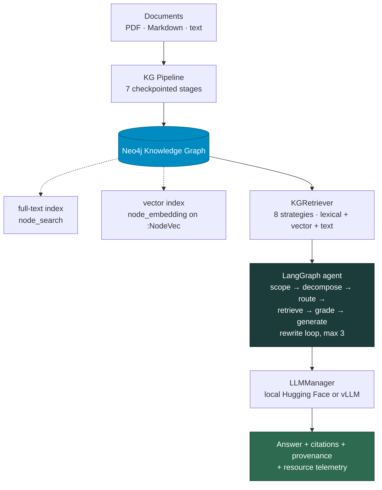

<div align="center">

<h1>GraphRAG Pipeline</h1>

<p><strong>An experiment-oriented Retrieval-Augmented Generation pipeline that builds a Knowledge Graph from a document corpus, retrieves over it through eight configurable strategies, and scores the answers against a frozen reference set.</strong></p>

[](https://github.com/FrancescoLazzarotto/graphRAG-pipeline/actions/workflows/ci.yml)
[](#testing)
[](https://www.python.org/)
[](https://neo4j.com/)
[](https://langchain-ai.github.io/langgraph/)
[](LICENSE)

<sub>Applied to a bilingual Italian/English corpus on the circular economy of food · retrieval, generation and evaluation in one repository</sub>

</div>

---

> [!NOTE]
> This is a research codebase. Every number it produces is traceable to a
> configuration file written next to it, and the sections that would let a reader
> over-read a result — [Known Limitations](#known-limitations) and
> [Reproducibility Notes](#reproducibility-notes) — are part of the
> documentation, not an appendix.

## Contents

| | |
|---|---|
| [Overview](#overview) · [Architecture](#architecture) | [Retrieval strategies](#retrieval-strategies) |
| [Install](#install) · [Quick start](#quick-start) | [Testing](#testing) |
| [Knowledge Graph pipeline](#knowledge-graph-pipeline) | [Repository structure](#repository-structure) |
| [Documentation map](#documentation-map) | [Known limitations](#known-limitations) · [Reproducibility](#reproducibility-notes) |

---

## Overview

The repository covers the full path from a folder of PDFs to a scored table:

| Stage | What happens |
|---|---|
| **Ingest** | PDF, Markdown and plain text are loaded, chunked by page-count profile, and passed through NER (GLiNER, multilingual) and LLM triple extraction |
| **Build** | Entities are resolved and linked — embeddings, predicate Jaccard, LLM confirmation — then ingested into Neo4j |
| **Retrieve** | Eight strategies, from pure text to multi-hop subgraph expansion and shortest-path traversal, over a **lexical** full-text channel and an optional **multilingual vector** channel |
| **Generate** | A LangGraph agent — scope → retrieve → grade → generate, with a bounded rewrite loop — backed by local Hugging Face models or an OpenAI-compatible vLLM server |
| **Ground** | Numbered evidence with document and page, a citation gate that checks every `[S1]`/`[T3]` tag against the visible index, a quote gate that checks every «quoted» passage against the retrieved text, and an optional verbatim-definition opener |
| **Measure** | Reproducible experiment matrices with resource telemetry, and an evaluation toolkit: retrieval metrics, text similarity, LLM-as-a-Judge, optional RAGAS, and a two-channel / two-level gold scorer |

### Entry points

| Entry point | Purpose |
|---|---|
| `graphrag-demo` — or `python -m graphrag.cli` | Single-question retrieval/generation and batch experiments; the full option surface |
| `graphrag-kg` — or `python -m kg_pipeline.main` | Knowledge Graph construction pipeline |
| `python scripts/runners/run_retrieval_matrix.py` | Standard-RAG vs GraphRAG matrices with resource telemetry |
| `graphrag-eval` — or `python -m evalkit.cli` | Evaluation toolkit |
| `python evaluation/scripts/score_gold_run.py` | Gold scoring for the paper: two channels, two levels |
| `streamlit run product/app.py` | UI Demo console |

---

## Architecture



The two dotted boxes are not optional decoration: the lexical index carries
in-language lookup and the vector index is the only channel that crosses the
Italian/English gap. **Both are built by scripts, not by ingestion.**

For each query the `KGRetriever`:

1. extracts entity candidates — quoted spans, capitalised phrases, numeric terms — and content keywords, optionally weighted by node-name document frequency (`lexical_specificity`);
2. runs one **lexical** full-text query, a Lucene OR-query with per-term boosts, for nodes and for triples;
3. optionally runs a **vector** query against the `:NodeVec` carriers;
4. picks anchors, by default only names retrieval actually returned (`verify_anchor_exists`), which avoids a full graph scan on an anchor that matches nothing;
5. expands neighbours, the subgraph and the shortest path;
6. drops uninformative predicates and ranks triples — lexical overlap · mention count · confidence, penalised for system links;
7. optionally retrieves raw text (BM25 or dense FAISS), capped per document and re-ranked for definitional questions.

---

## Install

Recommended environment: Conda, named `graphllm`. Python 3.12 is the version the
project is tested on; `pyproject.toml` declares a 3.10 floor and CI checks that
the sources still parse under it.

```bash
conda create -n graphllm python=3.12 -y
conda activate graphllm
pip install -e .
```

That single command is enough for the CLI, the KG pipeline and the demos —
`pyproject.toml` carries every runtime dependency. Optional extras, all
`pip install -e ".[<name>]"`:

| Extra | Contents |
|---|---|
| `demo` | Streamlit, for the browser demo in `product/` |
| `eval` | RAGAS, pandas, datasets, ROUGE, matplotlib |
| `gpu` | `bitsandbytes`, `autoawq`, `vllm` — GPU nodes serving models locally |
| `dev` | pytest and pytest-cov |

The requirements files remain for the pinned targets, where a resolver has to be
told exactly which wheel to take: `requirements.txt` (local, loose bounds),
`requirements-cpu.txt` (CPU cluster nodes), `requirements-gpu.txt` (GPU nodes,
CUDA 12.4, pins `torch==2.5.1+cu124`).

> [!TIP]
> Without `sacrebleu`, evalkit falls back to a simplified local BLEU. Keep it
> installed so published metrics come from the reference implementation.

Configuration is entirely environment-driven — `cp .env.example .env` and see
**[docs/configuration.md](docs/configuration.md)** for every variable and its
real default.

---

## Quick start

Assumes a populated Neo4j instance and a vLLM server already running. Starting
from an empty graph instead? Go to
[Knowledge Graph pipeline](#knowledge-graph-pipeline) first — retrieval quality
depends on the two index-building scripts run at its end.

```bash
# 1. health check — imports, graph and both indexes, generator, encoder
python scripts/smoke/smoke_check.py

# 2. one grounded, cited answer
graphrag-demo --llm --vllm --strategies hybrid \
  --question "What are the three C's of the Circular Economy for Food framework?" \
  --cite-evidence --citation-display label --enforce-language

# 3. the full reference campaign, 30 questions x 8 strategies
bash scripts/runners/run_abstention_arms.sh

# 4. score it — two channels, two levels
python evaluation/scripts/score_gold_run.py \
  --run-dir exp_results/<run_dir>/ \
  --gold evaluation/gold/gold_v3.json \
  --out-prefix artifacts/evaluation/<name>
```

---

## Knowledge Graph pipeline

The pipeline lives in [`kg_pipeline/`](kg_pipeline/) and writes checkpointed
stage artifacts to a run directory. Defaults come from
[`kg_pipeline/config.yaml`](kg_pipeline/config.yaml).

```bash
PYTHONUNBUFFERED=1 conda run -n graphllm python -m kg_pipeline.main \
  --config kg_pipeline/config.yaml \
  --env-file kg_pipeline/.env \
  --log-level INFO
```

Stages run sequentially with JSON checkpoint recovery, each reading the artifacts
of the previous one. `--stage <name>` runs everything **up to and including** that
stage, reusing earlier artifacts where they exist; it does not run one stage in
isolation. Reuse the same `--run-dir` to resume.

| `--stage` | Description | Main artifact |
|---|---|---|
| `ingestion` | Load raw documents — PDF → markdown, page chunks, sections | `stage0_documents.json` |
| `chunking` | Token-windowed paragraph chunks, three size profiles by page count | `stage1_chunks.json` |
| `ner` | Named Entity Recognition — GLiNER, multilingual | `stage2_ner.json` |
| `llm` | LLM triple extraction — async, batched, checkpointed | `stage3_triples_raw.json`, `stage3_acronyms.json` |
| `resolution` | Entity resolution — embeddings + predicate Jaccard + LLM confirmation | `stage4_triples_resolved.json`, `stage4_registry.json`, `stage4_merge_approved.json` |
| `linking` | `SAME_AS` alias edges, optional `MENTIONED_IN` | `stage5_triples_linked.json` |
| `neo4j` | Graph ingestion — UNWIND + MERGE per label/predicate signature | `stage6_neo4j_summary.json` |

`--dry-run` skips Neo4j ingestion, `--single-doc <name>` processes one document.
Stage 3 checkpoints every `llm.checkpoint_every` chunks with atomic writes; the
run directory also holds `run_metadata.json` (seed, models, git commit, endpoint),
a snapshot of the config and relation vocabulary, and `failed_chunks.jsonl`.

### Post-processing and indexes

After Neo4j ingestion, **in this order**:

```bash
python scripts/kg/kg_postprocess.py --passes 1,2,3,4,5   # repair passes kg_repair.py .. kg_repair5.py
python scripts/kg/kg_search_index.py                     # full-text index — lexical retrieval
python scripts/kg/kg_vector_index.py                     # :NodeVec carriers + vector index — cross-lingual
```

The passes are distinct ordered repair rounds, not versions of one script, and
`--passes` defaults to `1,2,3,4` — pass 5 exists and is opt-in, so name it
explicitly as above. **Retrieval quality depends on the last two commands having
been run against the live graph.** Other graph utilities are listed in
[scripts/README.md](scripts/README.md).

---

## Retrieval strategies

| Strategy | Evidence used |
|---|---|
| `default` | All KG channels: nodes, triples, neighbourhoods, subgraph, shortest paths |
| `hybrid` | All KG channels **plus** raw-text retrieval |
| `text_only` | Text retrieval only — the sparse-retrieval baseline |
| `no_retrieval` | No retrieval channel — the LLM-only baseline |
| `text_plus_triples` | Entity nodes and triples only — no graph traversal |
| `neighbors_focus` | Triples plus local entity neighbourhoods |
| `subgraph_2hop` | Triples plus subgraph expansion, starting floor raised to 2 hops |
| `shortest_path` | Triples plus shortest paths between entities |

Defined once in [`src/graphrag/strategies.py`](src/graphrag/strategies.py) and
imported by both the CLI and the matrix runner. Presets toggle only the channel
flags; cardinality limits and ranking options come from the base `AgentConfig`,
and the fully resolved per-strategy config is serialised into every run's
`config.json`.

> The subgraph channel is **adaptive**: it starts at `hops` (base default `1`) and
> widens one hop at a time until it has `min_subgraph_triples` or reaches
> `max_hops` (`4`). `subgraph_2hop` raises the starting floor to 2 and drops the
> node, neighbour and shortest-path channels — it is not "the 2-hop arm" against
> 1-hop siblings. Full detail in [docs/cli.md](docs/cli.md#retrieval-strategies).

---

## Documentation map

| Document | Covers |
|---|---|
| **[docs/configuration.md](docs/configuration.md)** | Every environment variable and its real default; how `.env` is loaded per entry point |
| **[docs/cli.md](docs/cli.md)** | The complete `graphrag.cli` flag surface — the single source of truth for options |
| **[docs/experiments.md](docs/experiments.md)** | Reference sets, which runner to use, campaign drivers, run output layout, analysis scripts |
| **[docs/troubleshooting.md](docs/troubleshooting.md)** | Symptoms seen in this project, with the cause that actually produced them |
| **[docs/cluster.md](docs/cluster.md)** | SLURM templates, node-specific installs, submission |
| **[COMMANDS.md](COMMANDS.md)** | Task recipes — copy-paste command sequences per job |
| **[evaluation/README.md](evaluation/README.md)** | Gold sets, the two-channel/two-level scorer, evalkit, judge, RAGAS |
| **[scripts/README.md](scripts/README.md)** | What lives in each script group |
| **[product/README.md](product/README.md)** | The two demo surfaces and where the engine/presentation line is |
| **[AGENTS.md](AGENTS.md)** | Repository guide for coding agents and new contributors |

---

## Testing

```bash
pytest -q     # 526 tests: 252 agent/retrieval, 31 KG pipeline, 243 evaluation
```

The paths come from `[tool.pytest.ini_options]` in `pyproject.toml`, so the bare
command works from any working directory.

34 of them live in `tests/test_audit_fixes.py` and each locks one finding from the
August 2026 code audit. Every one of them passed *before* its fix — which is why
the suite gave no signal at all, and why they are worth keeping.

CI runs two jobs on every push to `main`/`master` and on every pull request:

| Job | What it proves |
|---|---|
| `syntax` | `compileall` under Python 3.10 — the floor declared in `pyproject.toml` still parses |
| `test` | `pip install -e ".[dev]"` from `pyproject.toml` alone, then the full suite |

The `test` job installs from `pyproject.toml` and never from a requirements file,
so a dependency declared in only one of the two shows up as a CI failure rather
than in a user's clean install.

Health checks and smoke scripts: see
[docs/troubleshooting.md](docs/troubleshooting.md#health-checks).

---

## Repository structure

```text
.
├── src/graphrag/            # main package
│   ├── cli.py               #   CLI + experiment orchestration
│   ├── config.py            #   AgentConfig / KGConfig
│   ├── strategies.py        #   the 8 retrieval presets — single source of truth
│   ├── questions.py         #   question-file parsing (txt / json / jsonl / csv)
│   ├── embeddings.py        #   shared multilingual encoder client
│   ├── types.py             #   RAGState and the retrieval contract
│   ├── agent/               #   LangGraph state machine, evidence/citations, memory, cache, compression
│   ├── kg/                  #   Neo4j manager and retriever
│   ├── llm/                 #   backends, prompt library, refusal markers
│   ├── text_rag/            #   BM25 lexical and dense (FAISS) text channels
│   └── experiments/         #   experiment runner, standard-RAG presets, resource monitor
├── kg_pipeline/             # KG construction pipeline
│   ├── config.yaml          #   ontology, chunking profiles, model choices
│   ├── main.py              #   stage orchestration and checkpoint recovery
│   ├── stages/              #   ingestion → chunking → ner → llm → resolution → linking → neo4j
│   └── tests/
├── evaluation/              # evaluation workspace
│   ├── evalkit/             #   metrics, LLM judge, reports (CLI: python -m evalkit.cli)
│   ├── gold/                #   gold QA datasets, templates, schema
│   │   ├── gold_v3.json     #     frozen reference set, English
│   │   └── gold_v3_it.json  #     frozen reference set, Italian
│   ├── scripts/             #   score_gold_run.py, build_results_tables.py, hard_subset.py, figures
│   ├── fixtures/            #   question sets for matrix runs
│   ├── baselines/           #   regression baselines
│   └── tests/
├── product/                 # the two demo surfaces over the engine
├── scripts/                 # operational entrypoints, grouped by job — see scripts/README.md
│   ├── kg/ · gold/ · domain_gate/ · runners/
│   └── smoke/ · analysis/ · serving/ · cluster/
├── tests/                   # core unit tests, incl. test_audit_fixes.py
├── docs/                    # configuration, CLI, experiments, troubleshooting, cluster
├── AGENTS.md                # repository guide for coding agents
├── COMMANDS.md              # task recipes
├── CITATION.cff
├── pyproject.toml
├── requirements.txt         # + requirements-cpu.txt / requirements-gpu.txt
└── .env.example             # configuration template
```

Not tracked by git, created at runtime: `documents/` (source corpus), `artifacts/`
(experiment and evaluation outputs), `logs/`, `kg_pipeline/artifacts/`. Thesis
campaign outputs (`exp_results*/`) live outside the repository tree, as do the
internal working documents — audits, plans, worklogs and probes under `docs/`.

---

## Known limitations

Documented so results are read correctly. Each was checked against the artifacts
of real runs.

**Accepted, with the measurement that justifies accepting them**

- **Edge provenance is single-valued.** A triple attested in several documents keeps the `source_doc` / `page_range` of the last ingestion. Measured: **106 of 13 058 edges (0.8%)** carry more than one document — a schema change to list-valued provenance was not worth the risk to the citation layer.
- **APOC is a hard dependency**, with no whitelist fallback for node projection.
- **Entity resolution materialises a full similarity matrix** (~576 MB at 12k groups). A scaling limit on larger corpora, not a defect on this one.
- **`PYTHONHASHSEED` cannot be set from inside the pipeline** — CPython reads it at interpreter startup. The pipeline warns instead of claiming to seed it; export it before launching if set-iteration order must be reproducible.

**Gaps in the matrix runner** — outside the thesis path, since every reported number comes from `graphrag.cli --experiment`

- **`run_retrieval_matrix.py` cannot express the newer options.** Vector retrieval, citations, the domain gate, `--complexity`, `--drop-predicates` and the rest are CLI-only. Matrix runs measure stock defaults.
- **Matrix runs carry no `query_id`,** so the evaluator joins them to the gold by question text.

**Interpretation**

- **Two gold files coexist.** `evaluation/gold/gold.json` shares the 30 `query_id`s of `gold_v3.json` but differs in `expected_entities` on 7 of them, and several tools default to it. Pass `--gold evaluation/gold/gold_v3.json` explicitly for anything you intend to report.
- **`stage6_neo4j_summary.json`** reports `triples_sent` — triples that reached the database, an upper bound on edges because MERGE deduplicates. The authoritative edge count is the one read back from Neo4j in the same file. The old `relationships_written` key is kept for existing readers and holds the same value.
- **`--subgraph-limit` truncates in Cypher, before ranking.** On a sparse graph the cap never binds; on a dense one it decides the answer.
- **The demos do not enable the vector channel,** so a demo answer is not a retrieval measurement.

---

## Reproducibility notes

Several behaviours changed on **2026-08-17**. Runs produced before that date are
not directly comparable to runs produced after it.

| Change | Effect on earlier runs |
|---|---|
| The retrieved context no longer echoes `Query: <question>` | `context_text` was never empty while a query existed. The zero-evidence guard was unreachable, the relevance grader matched the question against itself so no rewrite ever fired, and `no_retrieval` received the question as its context under a prompt saying to use ONLY the provided context |
| The lexical text backend ranks with **Okapi BM25** (k1 1.5, b 0.75) | Earlier runs used a formula that was neither tf-idf cosine nor BM25 and was biased by chunk length |
| **MMR applies to both text backends** | `--text-retriever-mmr` was silently inert on the default lexical backend; earlier runs passed the flag and got plain relevance ranking |
| The citation gate validates against `visible_evidence_refs` | Earlier runs let a tag pointing at a compression-dropped block pass |
| The vector channel **raises** instead of degrading | Earlier runs dropped the channel on 3 queries in 3 of 6 compared models and 0 in the other 3 — a model-asymmetric change of retrieval method mid-comparison |
| Salient-term extraction is bilingual and word-boundary matched | An Italian-only stopword list made `the`, `and`, `are` salient on every English question, and substring matching then accepted every triple |
| Entity resolution accumulates aliases | Registry entries used to overwrite each other on a canonical-name collision: 17 333 initial groups → 11 792 registry entries in the July run |
| Merge confirmation votes once per pair | A pair was judged once per document bucket it touched, and a single `merge:true` out of five approved |
| `config.json` records `graph_target` | Earlier runs do not record which Neo4j instance they read |

Measured effect of the fixes — same model (Qwen2.5-7B), same graph, same 30
questions, answer channel:

| Pipeline | Concept F1 before | after | Δ |
|---|---|---|---|
| `hybrid` | 0.620 | **0.667** | +0.047 |
| `text_only` | 0.590 | 0.630 | +0.041 |
| `default` | 0.550 | 0.560 | +0.010 |
| `no_retrieval` | 0.531 | 0.544 | +0.014 |

The baseline moving by only +0.014 is the number that matters most: the
`hybrid` − `no_retrieval` gap is **+0.159 concept recall before and after**, so the
advantage was never an artefact of a damaged control.

---

## Citation

If you use this software, cite it via [`CITATION.cff`](CITATION.cff).

## License

Released under the [MIT License](LICENSE).
